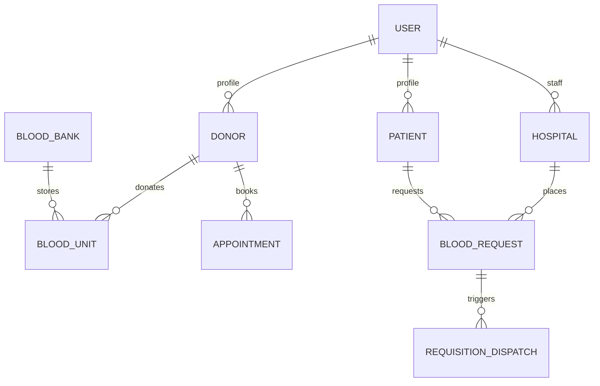

# LifeVault OBBMS — Software Requirements Specification (SRS) & System Architecture

**Document Version**: 2.0 (Enhanced Production Architecture)  
**System Name**: LifeVault — Online Blood Bank Management System (OBBMS)  
**Platform**: Fullstack Web Application (React + Vite + Tailwind CSS / Node.js + Express + MongoDB)  
**Target Delivery**: Agile Scrum Sprints (Jira-ready Epics & User Stories)  

---

## Table of Contents
1. [Executive Summary & Scope Revision](#1-executive-summary--scope-revision)
2. [Audit & Gap Analysis of Initial SRS (DOCX Critique)](#2-audit--gap-analysis-of-initial-srs-docx-critique)
3. [User Classes & Role-Based Access Control (RBAC)](#3-user-classes--role-based-access-control-rbac)
4. [System Architecture & Module Specification](#4-system-architecture--module-specification)
   - [Module 1: Authentication & Authorization (RBAC)](#module-1-authentication--authorization-rbac)
   - [Module 2: Donor Management & Eligibility Lifecycle](#module-2-donor-management--eligibility-lifecycle)
   - [Module 3: Patient & Guardian Request Management](#module-3-patient--guardian-request-management)
   - [Module 4: Blood Component Inventory & FEFO Engine](#module-4-blood-component-inventory--fefo-engine)
   - [Module 5: Clinical ABO/Rh Compatibility & Request Matching](#module-5-clinical-aborh-compatibility--request-matching)
   - [Module 6: Cold-Chain Telemetry & Refrigerator Storage](#module-6-cold-chain-telemetry--refrigerator-storage)
   - [Module 7: Emergency Hospital Requisition & Dispatch](#module-7-emergency-hospital-requisition--dispatch)
   - [Module 8: Donation Scheduling & Mobile Drive Management](#module-8-donation-scheduling--mobile-drive-management)
   - [Module 9: Lab Screening & Cross-Matching Audit](#module-9-lab-screening--cross-matching-audit)
   - [Module 10: Multi-Channel Notification & Alert Broadcast](#module-10-multi-channel-notification--alert-broadcast)
   - [Module 11: Real-Time Availability & Geolocation Search](#module-11-real-time-availability--geolocation-search)
   - [Module 12: Admin Dashboard, Analytics & Reporting](#module-12-admin-dashboard-analytics--reporting)
5. [Database Schema Design (MongoDB / Mongoose)](#5-database-schema-design-mongodb--mongoose)
6. [Non-Functional Requirements (NFRs)](#6-non-functional-requirements-nfrs)
7. [Implementation Action Plan for Web App Integration](#7-implementation-action-plan-for-web-app-integration)

---

## 1. Executive Summary & Scope Revision

The **LifeVault Online Blood Bank Management System (OBBMS)** is an end-to-end, enterprise-grade SaaS healthcare platform designed to connect voluntary blood donors, patients/recipients, hospital emergency departments, and regional blood bank administrators. 

### Core Mission
- **Zero Expiry Waste**: Enforce strict **First-Expired-First-Out (FEFO)** queue management.
- **Clinical Precision**: Eliminate manual transfusion errors with an automated **ABO/Rh Compatibility Engine** for all blood components (Whole Blood, PRBC, FFP, Platelets, Cryo).
- **Emergency Velocity**: Streamline emergency requisitions for 15-minute hospital dispatch.
- **Cold-Chain Assurance**: Provide continuous IoT temperature telemetry monitoring for blood storage lockers.

Unlike basic record-keeping systems, LifeVault combines public donor engagement, interactive live telemetry, emergency dispatch routing, and multi-role clinical dashboards into a unified web application.

---

## 2. Audit & Gap Analysis of Initial SRS (DOCX Critique)

Following a comprehensive technical review of `Blood_Bank_Management_System_SRS.docx` (Version 1.0), several critical healthcare, architectural, and data-integrity gaps were identified. This revised SRS rectifies those flaws as detailed below:

| # | Feature / Area | Identified Issue in Initial SRS (v1.0) | Resolution & Enhancement in LifeVault SRS (v2.0) |
|---|---|---|---|
| 1 | **Blood Component Processing** | Treated blood as generic "Blood Units" or whole blood. | Added full support for component separation: **Packed Red Blood Cells (PRBC)**, **Fresh Frozen Plasma (FFP)**, **Platelet Concentrates**, and **Cryoprecipitate**, each with distinct shelf-lives and storage temperatures. |
| 2 | **Clinical ABO/Rh Rules** | Assumed simple blood-group matching (e.g., O- for everyone). | Implemented component-specific compatibility matrix rules. *Note: FFP compatibility rules are the inverse of Red Blood Cell compatibility (AB is universal donor for FFP, O is universal recipient).* |
| 3 | **Inventory Expiry Management** | Simple FIFO/generic inventory listing without queue priority. | Integrated strict **FEFO (First-Expired-First-Out)** algorithm to prioritize units closest to expiration while suppressing expired stock from matchable pools. |
| 4 | **Cold-Chain Telemetry** | Complete absence of temperature and storage telemetry. | Created Module 6 (Cold-Chain Telemetry) monitoring storage temperatures ($2^\circ\text{C}-6^\circ\text{C}$ for RBC, $-18^\circ\text{C}$ for FFP, $20^\circ\text{C}-24^\circ\text{C}$ for Platelets) with automated breach alerts. |
| 5 | **Emergency Dispatch** | Single-tier request creation without urgency dispatch protocols. | Introduced 3-tier request prioritization (**Emergency Trauma**, **Surgical Reserve**, **Routine**) with fast-track allocation and real-time courier tracking. |
| 6 | **Lab Cross-Matching** | No laboratory validation phase between request approval and dispatch. | Added Module 9 (Lab Screening & Cross-Matching Audit) to record ABO re-typing, antibody screening, and compatibility cross-match verification before issuing blood units. |
| 7 | **Landing & Marketing Scope** | Excluded public landing and availability search from scope. | Integrated public landing UI featuring live telemetry dashboards, interactive compatibility guides, and instant modal workflows for donors and hospitals. |
| 8 | **Data Concurrency & State Machine** | No database transaction locking for unit reservations. | Enforced MongoDB ACID transactions (`mongoose.startSession()`) during request approval to prevent double allocation of scarce blood units. |

---

## 3. User Classes & Role-Based Access Control (RBAC)

The system supports five distinct user classes with granular permissions:

```
                  ┌─────────────────────────────────────────┐
                  │              SUPER ADMIN                │
                  │   Platform-wide analytics, Blood Bank   │
                  │     Branch CRUD, User Role Overrides    │
                  └────────────────────┬────────────────────┘
                                       │
            ┌──────────────────────────┴──────────────────────────┐
            ▼                                                     ▼
┌───────────────────────┐                             ┌───────────────────────┐
│   BLOOD BANK ADMIN    │                             │    HOSPITAL DOCTOR    │
│ Branch stock, FEFO,   │                             │ Emergency orders, ER  │
│ Approvals, Dispatches │                             │ dispatch, Patient link│
└───────────┬───────────┘                             └───────────┬───────────┘
            │                                                     │
            ▼                                                     ▼
┌───────────────────────┐                             ┌───────────────────────┐
│    VOLUNTARY DONOR    │                             │   PATIENT / RECIPIENT │
│ Registration, Slots,  │                             │ Track requests, Find  │
│ Eligibility, Badges   │                             │ Blood, Guarded Orders │
└───────────────────────┘                             └───────────────────────┘
```

1. **Super Admin**: Platform-wide configuration, creation of blood bank branches, system-wide analytics, and audit log inspection.
2. **Blood Bank Administrator (BBA)**: Branch-level manager overseeing blood stock, component processing, request approvals/rejections, and courier dispatches.
3. **Hospital Doctor / Staff**: Authorized clinical user placing urgent transfusion orders, tracking live ER courier dispatches, and managing hospital reserves.
4. **Voluntary Donor**: Registered citizen checking eligibility, booking donation appointments, viewing donation history, and earning life-saver badges.
5. **Patient / Recipient**: Individual (or guardian) searching real-time regional blood availability, submitting requests, and tracking fulfillment status.

---

## 4. System Architecture & Module Specification

### Module 1: Authentication & Authorization (RBAC)
- **Purpose**: Secure access control across all 5 roles via JWT tokens and encrypted sessions.
- **Key Features**:
  - Email/password signup with role selector (Donor, Patient, Hospital Doctor).
  - JWT Access Token (15-min expiry) + HTTP-Only Refresh Token (7-day expiry).
  - Password hashing via `bcrypt` (12 rounds).
  - Role-based route guard middleware (`requireAuth`, `requireRole(['ADMIN', 'DOCTOR'])`).
- **Data Schema (`User`)**:
  ```ts
  {
    _id: ObjectId,
    email: string,
    passwordHash: string,
    role: 'SUPER_ADMIN' | 'BBA' | 'DOCTOR' | 'DONOR' | 'PATIENT',
    name: string,
    phone: string,
    isVerified: boolean,
    createdAt: Date
  }
  ```

### Module 2: Donor Management & Eligibility Lifecycle
- **Purpose**: Manage donor registration, health screening, eligibility countdowns, and impact tracking.
- **Key Features**:
  - 90-day donation interval calculator (auto-computes `isEligible`).
  - Physical health criteria verification (Age 18–65, Weight $\ge 50\text{kg}$, Hemoglobin $\ge 12.5\text{g/dL}$).
  - Digital donor card generation with unique Donor ID (`#LV-DONOR-XXXX`).
  - Search/filter eligible donors by blood group and city for emergency call-outs.

### Module 3: Patient & Guardian Request Management
- **Purpose**: Facilitate patient-raised and guardian-raised blood requests with hospital linkage.
- **Key Features**:
  - Self or Guardian blood request forms.
  - Hospital room / attending physician reference tagging.
  - Real-time status tracker (Pending $\rightarrow$ Approved $\rightarrow$ Matched $\rightarrow$ Dispatched $\rightarrow$ Fulfilled).

### Module 4: Blood Component Inventory & FEFO Engine
- **Purpose**: System of record for tracking individual blood bags and enforcing First-Expired-First-Out (FEFO) queuing.
- **Key Features**:
  - Component tracking: Whole Blood (35 days), PRBC (42 days), FFP (1 year frozen), Platelets (5 days room temp).
  - Barcode unit tagging (`#LV-UNIT-YYYY`).
  - Automated cron job (`node-cron`) for daily auto-expiration of stock.
  - FEFO queue algorithm (`sort((a, b) => a.expiryDate - b.expiryDate)`).

### Module 5: Clinical ABO/Rh Compatibility & Request Matching
- **Purpose**: Automated compatibility calculator preventing illegal cross-transfusions.
- **Key Features**:
  - Component-aware compatibility matrix:
    - **RBC / Whole Blood**: O- is Universal Donor; AB+ is Universal Recipient.
    - **FFP (Plasma)**: AB is Universal Donor; O is Universal Recipient.
    - **Platelets**: ABO compatible preferred.
  - Multi-unit auto-allocation using active MongoDB ACID transactions.

### Module 6: Cold-Chain Telemetry & Refrigerator Storage
- **Purpose**: Real-time IoT temperature monitoring of blood storage lockers.
- **Key Features**:
  - Locker telemetry thresholds ($2^\circ\text{C}-6^\circ\text{C}$ for RBC, $-18^\circ\text{C}$ for FFP).
  - Visual gauge indicators (Green = Optimal, Yellow = Warning, Red = Breach).
  - Automated audit logging of temperature anomalies.

### Module 7: Emergency Hospital Requisition & Dispatch
- **Purpose**: Rapid-response portal for hospital emergency rooms and trauma centers.
- **Key Features**:
  - 3-tier urgency selector (**Emergency Trauma**, **Surgical Reserve**, **Routine**).
  - Emergency alert banner for high-priority dispatches.
  - Courier dispatch timer (15-minute SLA target).

### Module 8: Donation Scheduling & Mobile Drive Management
- **Purpose**: Appointment booking engine for blood centers and mobile donation camps.
- **Key Features**:
  - Time slot capacity limits to prevent overcrowding.
  - Blood drive camp organization by blood banks.
  - One-click post-donation check-in converting appointments directly into Inventory & History records.

### Module 9: Lab Screening & Cross-Matching Audit
- **Purpose**: Laboratory safety checkpoint before issuing blood units.
- **Key Features**:
  - Infectious disease screening log (HIV, Hepatitis B/C, Syphilis, Malaria).
  - Major & minor cross-match test logging (Compatible / Incompatible).
  - Immutable lab technician sign-off signature.

### Module 10: Multi-Channel Notification & Alert Broadcast
- **Purpose**: Real-time alerting for critical system events.
- **Key Features**:
  - Emergency SMS & Email broadcast to local donors during O- / B- shortages.
  - In-app notification center (bell badge with unread counts).
  - Automated status updates to patients and hospital staff.

### Module 11: Real-Time Availability & Geolocation Search
- **Purpose**: High-performance search for checking blood stocks across regional blood banks.
- **Key Features**:
  - Filter by Blood Group, Component, and City/Distance.
  - Ready/Low/Critical availability status badges.
  - Direct hospital & blood bank contact triggers.

### Module 12: Admin Dashboard, Analytics & Reporting
- **Purpose**: Executive control center for Blood Bank Admins and Super Admins.
- **Key Features**:
  - Live KPI cards (Total Units, Active Orders, Cold-Chain Status, Fulfillment Rate).
  - Interactive charts (Donation trends, demand distribution, component turnover).
  - Exportable audit reports in CSV and PDF formats.

---

## 5. Database Schema Design (MongoDB / Mongoose)



---

## 6. Non-Functional Requirements (NFRs)

1. **Performance**: API responses for availability search and dashboard summary $\le 300\text{ms}$.
2. **Security**: OWASP compliance, JWT bearer tokens, bcrypt password hashing, and role guard validation on all write routes.
3. **Data Consistency**: Strict MongoDB transactions during inventory deduction and allocation.
4. **Accessibility & Design**: Dark-mode glassmorphic theme with WCAG AA contrast compliance for high-stress clinical environments.
5. **Reliability**: 99.9% uptime target with automated error boundary fallbacks.

---

## 7. Implementation Action Plan for Web App Integration

To integrate these SRS specifications into the web application codebase immediately, the development team will execute the following action items:

### 1. Frontend Integration (`src/`)
- [x] **Modular Structure**: Organize code into `@ui`, `@layout`, `@modals`, `@pages`, `@services`, `@appTypes`, `@hooks`, and `@utils`.
- [x] **Interactive Dashboard**: Build telemetry, stock monitoring, and order approval controls (`@pages/dashboard`).
- [x] **Hospital & Donor Pages**: Implement dedicated section views and modals (`@pages/donor`, `@pages/hospital`, `@modals`).
- [ ] **State & API Integration**: Wire frontend services (`@services/inventoryService`, `@services/hospitalService`) to backend REST APIs.

### 2. Backend Integration (`backend/`)
- [x] **Service Layer**: Implement `CompatibilityEngine` (ABO/Rh matrix) and `FEFOQueueService` (inventory sorting).
- [x] **Controllers & Routes**: Structure Auth, Donor, Hospital, Inventory, and Requisition routes.
- [ ] **MongoDB Persistence**: Connect Mongoose models to cloud MongoDB Atlas instance.
- [ ] **Automated Cron Jobs**: Activate daily unit expiry checks via `node-cron`.

---

### Document Approval & Sign-Off
*Architect & Lead Software Engineer*: **Antigravity AI / Lead Architect**  
*Project Repository*: `C:\bbms`  
*Specification Status*: **Approved for Sprint Execution**
