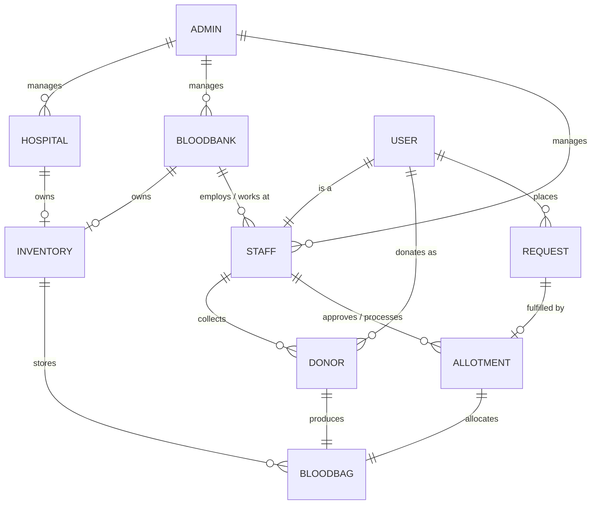

# LifeVault BBMS — Team Development Architecture & Directory Structure

**System Name**: Blood Bank Management System (BBMS)  
**Database Engine**: MongoDB 6.0+ with Mongoose ODM  
**Architecture Standard**: 10-Collection ER Model (`documents/er_diagram.png`)  
**Version**: 2.1 (ER-Aligned Architecture)  
**Last Updated**: 2026-08-20  

---

## 1. 📁 Repository Overview

```
bbms/
├── frontend / src/              # Frontend Application Architecture (React + Vite + Tailwind)
│   ├── components/              # Shared Reusable UI, Layouts & Modals
│   │   ├── ui/                  # Atomic & Design System UI Elements (Buttons, Cards, Canvas)
│   │   ├── layout/              # App Navigation & Footers (Navbar, Footer)
│   │   └── modals/              # Interactive Overlay Modals (Donor, Hospital, Search)
│   ├── pages/                   # Feature Pages & Role Portals
│   │   ├── home/                # Landing, Overview & Hero sections
│   │   ├── donor/               # Donor onboarding, scheduling & compatibility
│   │   ├── hospital/            # Hospital network portal & dispatch
│   │   └── dashboard/           # Real-time blood stock telemetry & cold-chain
│   ├── services/                # API Services & HTTP Clients (donor, hospital, inventory)
│   ├── types/                   # Shared TypeScript/JS Data Interfaces
│   ├── hooks/                   # Custom React Hooks
│   └── utils/                   # Helper Utilities & Compatibility Calculators
│
├── backend/                     # Backend API Microservice (Node.js / Express + Mongoose)
│   ├── config/                  # DB connection & Environment configuration
│   ├── controllers/             # Endpoint Handlers (Auth, Donor, Hospital, Inventory, Requisition)
│   ├── models/                  # 10 Core ER Models (Admin, Hospital, BloodBank, Staff, User,
│   │                            #                     Donor, Inventory, BloodBag, Request, Allotment)
│   ├── routes/                  # Express Route Definitions (/api/v1/*)
│   ├── services/                # Core Business Logic Engines (ABO/Rh Matrix, FEFO Queue)
│   ├── middleware/              # Authentication & Error Handling Middlewares
│   └── server.js                # Backend Server Initialization Entrypoint
│
└── documents/                   # Architecture & System Specifications
    ├── ARCHITECTURE.md          # This Guide
    ├── DBSCHEMA.md              # Database Schema & Data Dictionary (10 ER Collections)
    ├── DESIGN.md                # Liquid Glass Design System Guidelines
    ├── PRODUCT.md               # Product Positioning, Scope & Features
    ├── PRODUCT_README.md        # Comprehensive Product Guide & API Reference
    ├── SRS.md                   # Software Requirements Specification (v2.1)
    └── er_diagram.png           # Master System Entity Relationship Diagram
```

---

## 2. 🗄️ Database Architecture (10 ER Collections)

The database schema strictly adheres to the 10 entities and relationships defined in `documents/er_diagram.png`:



### Core Collections Reference

| Collection | Model | Primary Key | Foreign Keys / References | Description |
|---|---|---|---|---|
| `admins` | `Admin` | `_id` (`admin_id`) | — | Root system admins managing facilities & staff credentials |
| `hospitals` | `Hospital` | `_id` (`hos_id`) | `I_Id` $\rightarrow$ `Inventory`, `admin_id` $\rightarrow$ `Admin` | Healthcare facilities receiving & storing blood units |
| `bloodbanks` | `BloodBank` | `_id` (`bank_id`) | `I_Id` $\rightarrow$ `Inventory`, `admin_id` $\rightarrow$ `Admin` | Regional blood banks & collection centers |
| `staff` | `Staff` | `_id` (`S_Id`) | `u_id` $\rightarrow$ `User`, `hos_or_bank_id` $\rightarrow$ `Hospital`/`BloodBank` | Medical & lab personnel collecting & processing blood |
| `users` | `User` | `_id` (`u_Id`) | Extended by `Staff`, referenced by `Donor`, `Request` | Base user profiles (donors, patients, staff) |
| `donors` | `Donor` | `_id` (`D_Id`) | `u_id` $\rightarrow$ `User`, `bag_id` $\rightarrow$ `BloodBag`, `S_Id` $\rightarrow$ `Staff` | Blood donation events and donor session records |
| `inventories` | `Inventory` | `_id` (`I_ID`) | `hos_or_bank_id` $\rightarrow$ `Hospital`/`BloodBank` | Physical cold storage units (cells, shelves, racks) |
| `bloodbags` | `BloodBag` | `_id` (`bag_id`) | `S_Id` $\rightarrow$ `Staff`, `I_ID` $\rightarrow$ `Inventory` | Individual blood units with status, expiry, and vitals |
| `requests` | `Request` | `_id` (`req_id`) | `u_id` $\rightarrow$ `User`, `A_id` $\rightarrow$ `Allotment` | Blood requirements placed by users/recipients |
| `allotments` | `Allotment` | `_id` (`a_id`) | `req_id` $\rightarrow$ `Request`, `bag_id` $\rightarrow$ `BloodBag`, `s_id` $\rightarrow$ `Staff` | Completed blood unit allocations approved by staff |

---

## 3. 🛠️ Path Aliases for Easy Imports

| Alias | Path | Example Usage |
|---|---|---|
| `@ui` | `src/components/ui` | `import { AnimatedButton, SpotlightCard } from '@ui/index';` |
| `@layout` | `src/components/layout` | `import { Navbar, Footer } from '@layout/index';` |
| `@modals` | `src/components/modals` | `import { DonorModal, HospitalPortalModal } from '@modals/index';` |
| `@pages` | `src/pages` | `import { HeroSection, AboutSection } from '@pages/home';` |
| `@services`| `src/services` | `import { inventoryService } from '@services/inventoryService';` |
| `@types` | `src/types` | `import { BloodGroup, IDonor } from '@types/index';` |
| `@hooks` | `src/hooks` | `import { useModalState } from '@hooks/useModalState';` |
| `@utils` | `src/utils` | `import { canDonateTo } from '@utils/compatibilityMatrix';` |
| `@backend` | `backend` | `import { User, BloodBag, Request } from '@backend/models/index.js';` |

---

## 4. 👥 Team Responsibilities & Workflow

### 🎨 Frontend Team Focus Areas
- **UI Components (`src/components/ui/`)**: Reusable atomic visual components.
- **Pages & Portals (`src/pages/`)**: Domain pages categorized into `home`, `donor`, `hospital`, and `dashboard`.
- **API Client Layer (`src/services/`)**: REST integration layer interacting with `/api/v1/*` endpoints.

### ⚙️ Backend Team Focus Areas
- **Controllers & Routes (`backend/controllers/`, `backend/routes/`)**: REST endpoints mapping request payloads to the 10 ER models.
- **Mongoose Data Models (`backend/models/`)**: Strict schemas with validation, virtual IDs, and compound indexes.
- **Domain Services (`backend/services/`)**: ABO/Rh compatibility engine and FEFO (First-Expired-First-Out) queue allocation.

---

## 5. 🚀 Running the Project

```bash
# Frontend Development Server
npm run dev

# Backend API Server
npm run server

# Production Build Verification
npm run build
```
