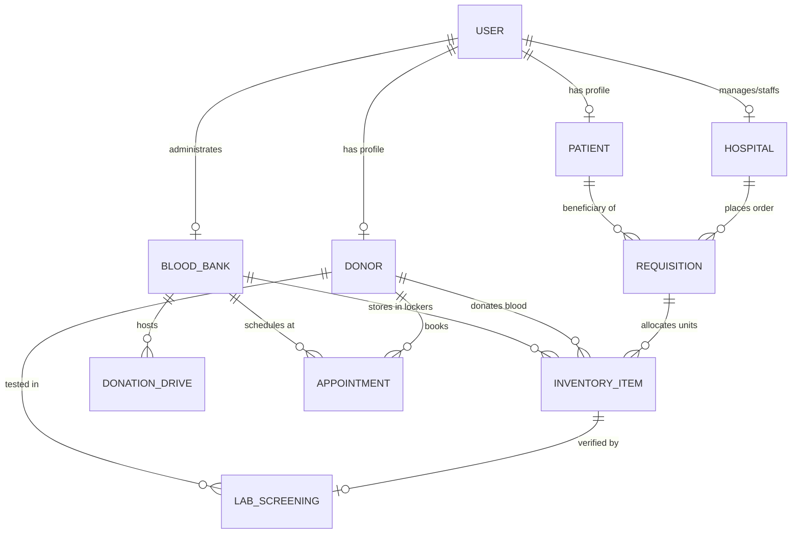

# LifeVault BBMS — Database Schema & Data Dictionary Specification

**System Name**: LifeVault Online Blood Bank Management System (OBBMS)  
**Database Engine**: MongoDB 6.0+ with Mongoose ODM  
**Version**: 2.0 (Production Architecture)  
**Last Updated**: 2026-08-20  

---

## 1. Entity Relationship (ER) Overview



---

## 2. Global Enums & Constants

| Enum Name | Allowed Values | Clinical / Domain Description |
|---|---|---|
| `BloodGroup` | `'A+'`, `'A-'`, `'B+'`, `'B-'`, `'AB+'`, `'AB-'`, `'O+'`, `'O-'` | Standard ABO/Rh clinical blood classification |
| `BloodComponent` | `'WHOLE_BLOOD'`, `'PRBC'`, `'RBC'`, `'PLATELETS'`, `'FFP'`, `'PLASMA'`, `'CRYO'` | Clinical fractionated blood components |
| `UserRole` | `'SUPER_ADMIN'`, `'BBA'`, `'DOCTOR'`, `'DONOR'`, `'PATIENT'`, `'ADMIN'`, `'HOSPITAL'`, `'STAFF'` | RBAC permission level |
| `InventoryStatus` | `'AVAILABLE'`, `'RESERVED'`, `'DISPATCHED'`, `'EXPIRED'`, `'DISCARDED'`, `'TRANSFUSED'` | Unit lifecycle state machine |
| `RequisitionUrgency` | `'NORMAL'`, `'URGENT'`, `'CRITICAL'`, `'EMERGENCY_TRAUMA'`, `'SURGICAL_RESERVE'`, `'ROUTINE'` | Priority ranking for FEFO dispatch |
| `RequisitionStatus` | `'PENDING'`, `'APPROVED'`, `'MATCHED'`, `'DISPATCHED'`, `'FULFILLED'`, `'REJECTED'`, `'CANCELLED'` | Fulfillment state machine |
| `AppointmentStatus` | `'SCHEDULED'`, `'CONFIRMED'`, `'COMPLETED'`, `'CANCELLED'`, `'NO_SHOW'` | Donor appointment booking state |
| `LabResult` | `'PASSED'`, `'FAILED'`, `'PENDING'` | Safety screening verdict |
| `CrossMatchStatus` | `'COMPATIBLE'`, `'INCOMPATIBLE'`, `'NOT_TESTED'` | Transfusion cross-matching audit |
| `DriveStatus` | `'UPCOMING'`, `'ACTIVE'`, `'COMPLETED'`, `'CANCELLED'` | Mobile camp lifecycle status |

---

## 3. Detailed Collection Schemas

### 3.1. `users` Collection (`User` Model)
Represents all authenticated identities across the system with Role-Based Access Control (RBAC).

```json
{
  "_id": "ObjectId",
  "name": "String (Required, Trimmed)",
  "email": "String (Required, Unique, Lowercase, Trimmed, Indexed)",
  "password": "String (Bcrypt Hash, Select: false)",
  "role": "String (Enum: UserRole, Default: 'DONOR', Indexed)",
  "phone": "String (Trimmed)",
  "bloodGroup": "String (Enum: BloodGroup)",
  "dob": "Date",
  "gender": "String (Enum: ['MALE', 'FEMALE', 'OTHER'])",
  "pincode": "String (Trimmed)",
  "city": "String (Trimmed)",
  "hospitalName": "String (Trimmed, Optional)",
  "licenseId": "String (Trimmed, Optional)",
  "avatar": "String (URL)",
  "isVerified": "Boolean (Default: false)",
  "status": "String (Enum: ['ACTIVE', 'INACTIVE', 'SUSPENDED'], Default: 'ACTIVE')",
  "lastLogin": "Date",
  "createdAt": "Date (Timestamp)",
  "updatedAt": "Date (Timestamp)"
}
```
**Indexes**:
- `{ email: 1 }` (Unique)
- `{ role: 1 }`
- `{ phone: 1 }`

---

### 3.2. `donors` Collection (`Donor` Model)
Tracks voluntary donor clinical eligibility, health screening stats, and historical donations.

```json
{
  "_id": "ObjectId",
  "userId": "ObjectId (Ref: 'User', Indexed)",
  "donorId": "String (Unique, E.g., '#LV-DONOR-1042', Indexed)",
  "name": "String (Required, Trimmed)",
  "phone": "String (Required, Trimmed, Indexed)",
  "email": "String (Lowercase, Trimmed)",
  "bloodGroup": "String (Required, Enum: BloodGroup, Indexed)",
  "city": "String (Required, Trimmed, Indexed)",
  "age": "Number (Min: 18, Max: 65)",
  "gender": "String (Enum: ['MALE', 'FEMALE', 'OTHER'])",
  "weightKg": "Number (Min: 45, Default: 50)",
  "hemoglobin": "Number (Min: 0, E.g., 13.5 g/dL)",
  "isEligible": "Boolean (Default: true, Indexed)",
  "eligibilityStatus": "String (Enum: ['ELIGIBLE', 'INELIGIBLE', 'TEMPORARY_DEFERRAL', 'PERMANENT_DEFERRAL'], Default: 'ELIGIBLE')",
  "deferralReason": "String",
  "deferralUntil": "Date",
  "totalDonationsCount": "Number (Default: 0)",
  "lastDonationDate": "Date",
  "digitalBadge": "String (Enum: ['BRONZE_HERO', 'SILVER_LIFESAVER', 'GOLD_GUARDIAN', 'PLATINUM_CHAMPION'], Default: 'BRONZE_HERO')",
  "address": {
    "street": "String",
    "city": "String",
    "state": "String",
    "pincode": "String",
    "coordinates": {
      "lat": "Number",
      "lng": "Number"
    }
  },
  "createdAt": "Date (Timestamp)",
  "updatedAt": "Date (Timestamp)"
}
```
**Indexes**:
- `{ donorId: 1 }` (Unique)
- `{ bloodGroup: 1, city: 1, isEligible: 1 }` (Compound for emergency callout search)
- `{ userId: 1 }`

---

### 3.3. `patients` Collection (`Patient` Model)
Records patient recipient profiles and medical history for guarded blood requisitions.

```json
{
  "_id": "ObjectId",
  "userId": "ObjectId (Ref: 'User', Optional, Indexed)",
  "name": "String (Required, Trimmed)",
  "phone": "String (Required, Trimmed)",
  "email": "String (Lowercase, Trimmed)",
  "bloodGroup": "String (Required, Enum: BloodGroup, Indexed)",
  "dob": "Date",
  "age": "Number",
  "gender": "String (Enum: ['MALE', 'FEMALE', 'OTHER'])",
  "medicalRecordNumber": "String (Trimmed, Indexed)",
  "hospitalName": "String (Trimmed)",
  "attendingPhysician": "String (Trimmed)",
  "guardianName": "String (Trimmed)",
  "guardianPhone": "String (Trimmed)",
  "guardianRelation": "String (Trimmed)",
  "address": {
    "street": "String",
    "city": "String",
    "state": "String",
    "pincode": "String"
  },
  "createdAt": "Date (Timestamp)",
  "updatedAt": "Date (Timestamp)"
}
```
**Indexes**:
- `{ bloodGroup: 1 }`
- `{ phone: 1 }`
- `{ medicalRecordNumber: 1 }`

---

### 3.4. `hospitals` Collection (`Hospital` Model)
Stores verified healthcare facilities, emergency room contact info, and dispatch network routing nodes.

```json
{
  "_id": "ObjectId",
  "userId": "ObjectId (Ref: 'User', Optional, Indexed)",
  "name": "String (Required, Trimmed, Indexed)",
  "licenseId": "String (Required, Unique, Trimmed, Indexed)",
  "city": "String (Required, Trimmed, Indexed)",
  "networkNode": "String (Trimmed, E.g., 'NODE-NY-NORTH-01')",
  "tier": "String (Enum: ['LEVEL_1_TRAUMA', 'GENERAL_HOSPITAL', 'SPECIALTY_CLINIC'], Default: 'GENERAL_HOSPITAL')",
  "phone": "String (Trimmed)",
  "emergencyContact": "String (Trimmed)",
  "isVerified": "Boolean (Default: false)",
  "address": {
    "street": "String",
    "city": "String",
    "state": "String",
    "pincode": "String",
    "coordinates": {
      "lat": "Number",
      "lng": "Number"
    }
  },
  "createdAt": "Date (Timestamp)",
  "updatedAt": "Date (Timestamp)"
}
```
**Indexes**:
- `{ licenseId: 1 }` (Unique)
- `{ city: 1, isVerified: 1 }`

---

### 3.5. `blood_banks` Collection (`BloodBank` Model)
Regional blood banks holding component inventory lockers and telemetry monitoring systems.

```json
{
  "_id": "ObjectId",
  "code": "String (Required, Unique, Trimmed, E.g., 'BB-METRO-01')",
  "name": "String (Required, Trimmed)",
  "licenseNumber": "String (Required, Unique, Trimmed)",
  "city": "String (Required, Trimmed, Indexed)",
  "contactNumber": "String (Required)",
  "email": "String (Lowercase, Trimmed)",
  "operatingHours": "String (Default: '24/7')",
  "storageCapacityUnits": "Number (Default: 5000)",
  "activeAlertsCount": "Number (Default: 0)",
  "address": {
    "street": "String",
    "city": "String",
    "state": "String",
    "pincode": "String",
    "coordinates": {
      "lat": "Number",
      "lng": "Number"
    }
  },
  "createdAt": "Date (Timestamp)",
  "updatedAt": "Date (Timestamp)"
}
```
**Indexes**:
- `{ code: 1 }` (Unique)
- `{ licenseNumber: 1 }` (Unique)
- `{ city: 1 }`

---

### 3.6. `inventory_items` Collection (`InventoryItem` Model)
Tracks individual blood bags/units with cold-chain storage telemetry, component type, and FEFO expiry management.

```json
{
  "_id": "ObjectId",
  "unitBarcode": "String (Required, Unique, Trimmed, E.g., 'LV-UNIT-2026-001', Indexed)",
  "bloodBankId": "ObjectId (Ref: 'BloodBank', Optional, Indexed)",
  "donorId": "ObjectId (Ref: 'Donor', Optional, Indexed)",
  "bloodGroup": "String (Required, Enum: BloodGroup, Indexed)",
  "component": "String (Required, Enum: BloodComponent, Default: 'WHOLE_BLOOD', Indexed)",
  "volumeMl": "Number (Required, Min: 50, Max: 600)",
  "collectionDate": "Date (Required, Default: Date.now)",
  "expirationDate": "Date (Required, Indexed)",
  "storageLockerId": "String (Trimmed, E.g., 'LOCKER-ALPHA-01')",
  "storageTemperature": "Number (In Celsius, E.g., 4.2)",
  "temperatureStatus": "String (Enum: ['OPTIMAL', 'WARNING', 'BREACH'], Default: 'OPTIMAL')",
  "status": "String (Enum: InventoryStatus, Default: 'AVAILABLE', Indexed)",
  "labScreeningId": "ObjectId (Ref: 'LabScreening', Optional)",
  "reservedForRequisitionId": "ObjectId (Ref: 'Requisition', Optional)",
  "createdAt": "Date (Timestamp)",
  "updatedAt": "Date (Timestamp)"
}
```
**Indexes**:
- `{ unitBarcode: 1 }` (Unique)
- `{ bloodGroup: 1, component: 1, status: 1, expirationDate: 1 }` (Compound for rapid FEFO allocation queries)
- `{ expirationDate: 1 }` (For auto-expiration cron worker)

---

### 3.7. `requisitions` Collection (`Requisition` Model)
Emergency hospital orders and patient requests with clinical priority tiers and courier dispatch telemetry.

```json
{
  "_id": "ObjectId",
  "requisitionNumber": "String (Unique, E.g., 'REQ-2026-9042', Indexed)",
  "hospital": "ObjectId (Ref: 'Hospital', Optional, Indexed)",
  "hospitalName": "String (Required, Trimmed)",
  "patient": "ObjectId (Ref: 'Patient', Optional, Indexed)",
  "patientName": "String (Trimmed)",
  "bloodGroup": "String (Required, Enum: BloodGroup, Indexed)",
  "component": "String (Enum: BloodComponent, Default: 'WHOLE_BLOOD')",
  "unitsRequested": "Number (Required, Min: 1)",
  "unitsAllocated": "Number (Default: 0)",
  "allocatedUnitIds": ["ObjectId (Ref: 'InventoryItem')"],
  "urgencyLevel": "String (Enum: RequisitionUrgency, Default: 'NORMAL', Indexed)",
  "status": "String (Enum: RequisitionStatus, Default: 'PENDING', Indexed)",
  "reasonForRequest": "String (Trimmed)",
  "targetHospitalAddress": "String (Trimmed)",
  "approvedBy": "ObjectId (Ref: 'User', Optional)",
  "requestedAt": "Date (Default: Date.now)",
  "requiredBy": "Date",
  "dispatchDetails": {
    "courierName": "String",
    "trackingNumber": "String",
    "dispatchedAt": "Date",
    "estimatedArrival": "Date",
    "deliveredAt": "Date",
    "currentStatus": "String"
  },
  "createdAt": "Date (Timestamp)",
  "updatedAt": "Date (Timestamp)"
}
```
**Indexes**:
- `{ requisitionNumber: 1 }` (Unique)
- `{ status: 1, urgencyLevel: 1, requestedAt: -1 }` (Compound for triage dashboard queries)
- `{ hospital: 1 }`

---

### 3.8. `appointments` Collection (`Appointment` Model)
Donor appointment slots booked at regional blood banks or mobile donation drives.

```json
{
  "_id": "ObjectId",
  "appointmentId": "String (Unique, E.g., 'LV-APT-2026-8801', Indexed)",
  "donor": "ObjectId (Ref: 'Donor', Required, Indexed)",
  "bloodBank": "ObjectId (Ref: 'BloodBank', Optional, Indexed)",
  "drive": "ObjectId (Ref: 'DonationDrive', Optional, Indexed)",
  "scheduledDate": "Date (Required, Indexed)",
  "timeSlot": "String (Required, E.g., '09:00 - 10:00')",
  "location": "String (Required, Trimmed)",
  "status": "String (Enum: AppointmentStatus, Default: 'SCHEDULED', Indexed)",
  "notes": "String (Trimmed)",
  "createdAt": "Date (Timestamp)",
  "updatedAt": "Date (Timestamp)"
}
```
**Indexes**:
- `{ appointmentId: 1 }` (Unique)
- `{ donor: 1, scheduledDate: 1 }`
- `{ bloodBank: 1, scheduledDate: 1 }`

---

### 3.9. `donation_drives` Collection (`DonationDrive` Model)
Community blood donation camps organized by regional blood centers and universities/corporate partners.

```json
{
  "_id": "ObjectId",
  "driveCode": "String (Required, Unique, Trimmed, E.g., 'DRIVE-CHI-2026')",
  "title": "String (Required, Trimmed)",
  "organizer": "String (Required, Trimmed)",
  "bloodBankId": "ObjectId (Ref: 'BloodBank', Optional)",
  "venue": "String (Required, Trimmed)",
  "city": "String (Required, Trimmed, Indexed)",
  "startDate": "Date (Required)",
  "endDate": "Date (Required)",
  "targetUnits": "Number (Default: 100)",
  "collectedUnits": "Number (Default: 0)",
  "status": "String (Enum: DriveStatus, Default: 'UPCOMING', Indexed)",
  "createdAt": "Date (Timestamp)",
  "updatedAt": "Date (Timestamp)"
}
```
**Indexes**:
- `{ driveCode: 1 }` (Unique)
- `{ city: 1, status: 1 }`

---

### 3.10. `lab_screenings` Collection (`LabScreening` Model)
Laboratory infectious disease screening audit and cross-match verification records before release to inventory.

```json
{
  "_id": "ObjectId",
  "screeningId": "String (Required, Unique, Trimmed, E.g., 'LAB-2026-5501')",
  "unitId": "ObjectId (Ref: 'InventoryItem', Required, Indexed)",
  "donorId": "ObjectId (Ref: 'Donor', Optional, Indexed)",
  "bloodGroupVerified": "String (Required, Enum: BloodGroup)",
  "infectiousDiseases": {
    "hiv": { "type": "String", "enum": ["NEGATIVE", "POSITIVE", "PENDING"], "default": "NEGATIVE" },
    "hepatitisB": { "type": "String", "enum": ["NEGATIVE", "POSITIVE", "PENDING"], "default": "NEGATIVE" },
    "hepatitisC": { "type": "String", "enum": ["NEGATIVE", "POSITIVE", "PENDING"], "default": "NEGATIVE" },
    "syphilis": { "type": "String", "enum": ["NEGATIVE", "POSITIVE", "PENDING"], "default": "NEGATIVE" },
    "malaria": { "type": "String", "enum": ["NEGATIVE", "POSITIVE", "PENDING"], "default": "NEGATIVE" }
  },
  "crossMatchStatus": "String (Enum: CrossMatchStatus, Default: 'NOT_TESTED')",
  "hemoglobinLevel": "Number",
  "technicianId": "ObjectId (Ref: 'User', Optional)",
  "technicianSignature": "String (Trimmed)",
  "overallResult": "String (Enum: LabResult, Default: 'PENDING', Indexed)",
  "screeningDate": "Date (Default: Date.now)",
  "createdAt": "Date (Timestamp)",
  "updatedAt": "Date (Timestamp)"
}
```
**Indexes**:
- `{ screeningId: 1 }` (Unique)
- `{ unitId: 1 }`
- `{ overallResult: 1 }`

---

## 4. FEFO & Compatibility Optimization Rules

1. **FEFO Allocation Compound Index**:
   `{ bloodGroup: 1, component: 1, status: 1, expirationDate: 1 }` ensures that queries looking for viable units matching ABO compatibility sort instantly by earliest expiration date without costly in-memory sorts.
2. **ACID Transaction Locking**:
   Whenever a requisition is approved and inventory units are allocated, `mongoose.startSession()` and `session.withTransaction()` must be used to atomically mark selected `InventoryItem` records as `RESERVED` / `DISPATCHED` and link their IDs to `Requisition.allocatedUnitIds`.
3. **Password Privacy Guard**:
   `User.password` has `{ select: false }` by default to prevent accidental credential leakage in API responses.
