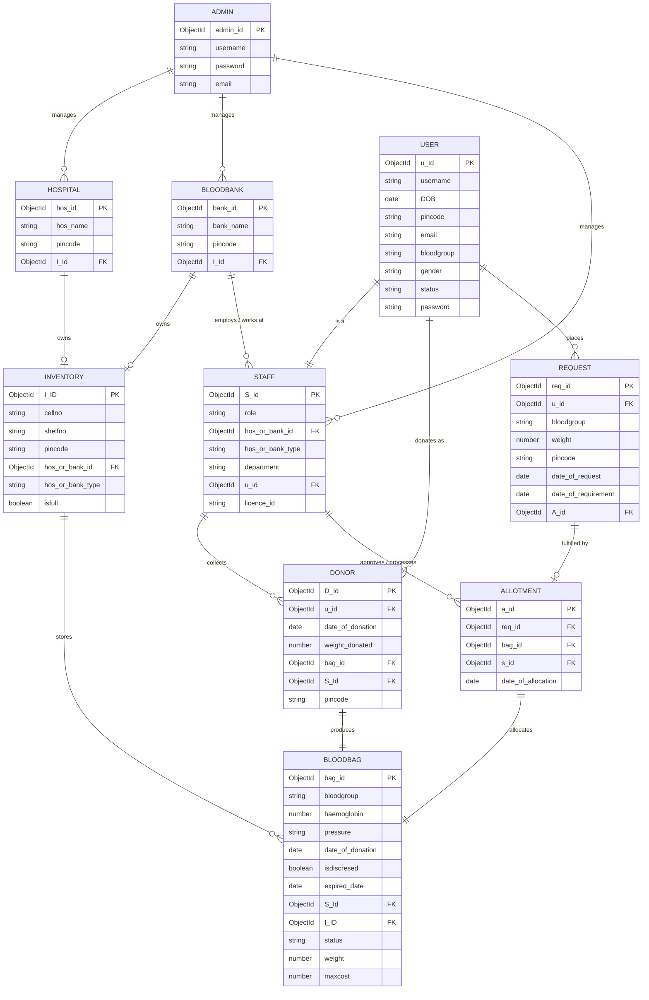

# LifeVault BBMS — Database Schema & Data Dictionary Specification

**System Name**: Blood Bank Management System (BBMS)  
**Database Engine**: MongoDB 6.0+ with Mongoose ODM  
**Specification Based On**: System ER Diagram (`documents/er_diagram.png`)  
**Version**: 2.1 (ER-Aligned Architecture)  
**Last Updated**: 2026-08-20  

---

## 1. Entity Relationship (ER) Overview

The following diagram represents the core entities, attributes, primary keys (PK), foreign keys (FK), and relationship cardinalities matching the system ER diagram:



---

## 2. Global Enums & Constants

| Enum Name | Allowed Values | Clinical / Domain Description |
|---|---|---|
| `BloodGroup` | `'A+'`, `'A-'`, `'B+'`, `'B-'`, `'AB+'`, `'AB-'`, `'O+'`, `'O-'` | Standard ABO/Rh blood groups |
| `Gender` | `'MALE'`, `'FEMALE'`, `'OTHER'` | Biological/Identified gender classification |
| `UserStatus` | `'ACTIVE'`, `'INACTIVE'`, `'PENDING'`, `'SUSPENDED'` | User profile and authentication status |
| `BloodBagStatus` | `'AVAILABLE'`, `'TESTING'`, `'RESERVED'`, `'ALLOCATED'`, `'TRANSFUSED'`, `'DISCARDED'`, `'EXPIRED'` | Blood bag lifecycle state machine |
| `StaffRole` | `'DOCTOR'`, `'NURSE'`, `'LAB_TECHNICIAN'`, `'PHLEBOTOMIST'`, `'MANAGER'`, `'STAFF'` | Staff job function |
| `FacilityType` | `'Hospital'`, `'BloodBank'` | Polymorphic discriminator for `hos/bank_id` |
| `RequestStatus` | `'PENDING'`, `'APPROVED'`, `'ALLOCATED'`, `'FULFILLED'`, `'REJECTED'`, `'CANCELLED'` | Blood request workflow stage |

---

## 3. Detailed Collection Specifications & Data Dictionary

### 3.1. `admins` Collection (`Admin` Model)
Represents root/system administrators managing facilities, blood banks, and staff credentials.

```json
{
  "_id": "ObjectId",
  "username": "String (Required, Unique, Trimmed)",
  "email": "String (Required, Unique, Lowercase, Trimmed)",
  "password": "String (Required, Bcrypt Hash, Select: false)",
  "createdAt": "Date (Timestamp)",
  "updatedAt": "Date (Timestamp)"
}
```

* **Data Dictionary**:
  * `_id` (`admin_id`): Unique MongoDB ObjectId identifier (Primary Key).
  * `username`: Admin username for login / identification.
  * `password`: Secure salted and hashed admin password (hidden by default in queries).
  * `email`: Official email address for admin operations.

* **Indexes**:
  * `{ username: 1 }` (Unique)
  * `{ email: 1 }` (Unique)

---

### 3.2. `hospitals` Collection (`Hospital` Model)
Healthcare institutions that manage patient blood requisitions and may host internal blood inventory units.

```json
{
  "_id": "ObjectId",
  "hos_name": "String (Required, Trimmed, Indexed)",
  "pincode": "String (Required, Trimmed, Indexed)",
  "I_Id": "ObjectId (Ref: 'Inventory', Optional, Indexed)",
  "admin_id": "ObjectId (Ref: 'Admin', Optional)",
  "phone": "String (Trimmed, Optional)",
  "email": "String (Lowercase, Trimmed, Optional)",
  "address": "String (Trimmed, Optional)",
  "createdAt": "Date (Timestamp)",
  "updatedAt": "Date (Timestamp)"
}
```

* **Data Dictionary**:
  * `_id` (`hos_id`): Unique Hospital identifier (Primary Key).
  * `hos_name`: Hospital/institution name.
  * `pincode`: Postal code of the hospital location.
  * `I_Id`: Foreign key pointing to owned `Inventory` unit storage.
  * `admin_id`: Foreign key reference to managing `Admin`.

* **Indexes**:
  * `{ hos_name: 1 }`
  * `{ pincode: 1 }`
  * `{ I_Id: 1 }`

---

### 3.3. `bloodbanks` Collection (`BloodBank` Model)
Regional blood banks, processing facilities, and collection banks.

```json
{
  "_id": "ObjectId",
  "bank_name": "String (Required, Trimmed, Indexed)",
  "pincode": "String (Required, Trimmed, Indexed)",
  "I_Id": "ObjectId (Ref: 'Inventory', Optional, Indexed)",
  "admin_id": "ObjectId (Ref: 'Admin', Optional)",
  "contact_no": "String (Trimmed, Optional)",
  "email": "String (Lowercase, Trimmed, Optional)",
  "address": "String (Trimmed, Optional)",
  "createdAt": "Date (Timestamp)",
  "updatedAt": "Date (Timestamp)"
}
```

* **Data Dictionary**:
  * `_id` (`bank_id`): Unique Blood Bank identifier (Primary Key).
  * `bank_name`: Name of the blood bank facility.
  * `pincode`: Location postal code.
  * `I_Id`: Foreign key pointing to owned `Inventory`.
  * `admin_id`: Foreign key reference to managing `Admin`.

* **Indexes**:
  * `{ bank_name: 1 }`
  * `{ pincode: 1 }`
  * `{ I_Id: 1 }`

---

### 3.4. `users` Collection (`User` Model)
The fundamental person record for donors, patients, and staff.

```json
{
  "_id": "ObjectId",
  "username": "String (Required, Unique, Trimmed, Indexed)",
  "email": "String (Required, Unique, Lowercase, Trimmed, Indexed)",
  "password": "String (Required, Bcrypt Hash, Select: false)",
  "DOB": "Date (Required)",
  "pincode": "String (Required, Trimmed, Indexed)",
  "bloodgroup": "String (Required, Enum: BloodGroup, Indexed)",
  "gender": "String (Required, Enum: Gender)",
  "status": "String (Enum: UserStatus, Default: 'ACTIVE')",
  "phone": "String (Trimmed, Optional)",
  "createdAt": "Date (Timestamp)",
  "updatedAt": "Date (Timestamp)"
}
```

* **Data Dictionary**:
  * `_id` (`u_Id`): Primary key for the User.
  * `username`: Public username / identifier.
  * `DOB`: Date of birth (used for donor eligibility and pediatric/geriatric verification).
  * `pincode`: Geographic postal code for proximity lookups.
  * `email`: User's electronic mail address.
  * `bloodgroup`: Standard ABO/Rh blood classification.
  * `gender`: Biological/identified gender (`'MALE'`, `'FEMALE'`, `'OTHER'`).
  * `status`: Account status (`'ACTIVE'`, `'INACTIVE'`, `'SUSPENDED'`).
  * `password`: Encrypted credentials hash.

* **Indexes**:
  * `{ email: 1 }` (Unique)
  * `{ username: 1 }` (Unique)
  * `{ pincode: 1, bloodgroup: 1 }` (Compound for rapid donor search)

---

### 3.5. `staff` Collection (`Staff` Model)
Hospital or blood bank personnel who collect donations, verify lab results, and process/approve allotments.

```json
{
  "_id": "ObjectId",
  "u_id": "ObjectId (Ref: 'User', Required, Unique, Indexed)",
  "role": "String (Required, Enum: StaffRole, Default: 'STAFF')",
  "department": "String (Required, Trimmed)",
  "licence_id": "String (Required, Unique, Trimmed, Indexed)",
  "hos_or_bank_id": "ObjectId (Required, RefPath: 'hos_or_bank_type', Indexed)",
  "hos_or_bank_type": "String (Required, Enum: ['Hospital', 'BloodBank'])",
  "admin_id": "ObjectId (Ref: 'Admin', Optional)",
  "createdAt": "Date (Timestamp)",
  "updatedAt": "Date (Timestamp)"
}
```

* **Data Dictionary**:
  * `_id` (`S_Id`): Staff primary identifier.
  * `u_id`: Foreign key pointing to the linked `User` record ("is a" relationship).
  * `role`: Staff role / designation.
  * `department`: Medical or operational department (e.g. Hematology, Pathology, Phlebotomy).
  * `licence_id`: Medical / professional license registration ID.
  * `hos_or_bank_id`: Foreign key (`hos/bank_id`) referencing the affiliated `Hospital` or `BloodBank`.
  * `hos_or_bank_type`: Discriminator determining whether `hos_or_bank_id` references `Hospital` or `BloodBank`.

* **Indexes**:
  * `{ licence_id: 1 }` (Unique)
  * `{ u_id: 1 }` (Unique)
  * `{ hos_or_bank_id: 1, hos_or_bank_type: 1 }`

---

### 3.6. `donors` Collection (`Donor` Model)
Represents a blood donation event/profile linked to an active user.

```json
{
  "_id": "ObjectId",
  "u_id": "ObjectId (Ref: 'User', Required, Indexed)",
  "date_of_donation": "Date (Required, Default: Date.now, Indexed)",
  "weight_donated": "Number (Required, In ml/grams, E.g., 450)",
  "bag_id": "ObjectId (Ref: 'BloodBag', Optional, Unique, Indexed)",
  "S_Id": "ObjectId (Ref: 'Staff', Required, Indexed)",
  "pincode": "String (Required, Trimmed, Indexed)",
  "createdAt": "Date (Timestamp)",
  "updatedAt": "Date (Timestamp)"
}
```

* **Data Dictionary**:
  * `_id` (`D_Id`): Unique Donor donation record identifier (Primary Key).
  * `u_id`: Foreign key linking to the `User` who donated.
  * `date_of_donation`: Timestamp when the donation occurred.
  * `weight_donated`: Volume or weight of blood collected (e.g., 450 ml).
  * `bag_id`: Foreign key pointing to the specific `BloodBag` produced by this donation.
  * `S_Id`: Foreign key to `Staff` phlebotomist/attendant who collected the blood.
  * `pincode`: Postal code of donation site/camp.

* **Indexes**:
  * `{ u_id: 1, date_of_donation: -1 }`
  * `{ bag_id: 1 }` (Unique sparse index)
  * `{ S_Id: 1 }`
  * `{ pincode: 1 }`

---

### 3.7. `inventories` Collection (`Inventory` Model)
Physical or logical cold storage repository (shelves, refrigerators, cryogenic cells) owned by a hospital or blood bank.

```json
{
  "_id": "ObjectId",
  "cellno": "String (Required, Trimmed)",
  "shelfno": "String (Required, Trimmed)",
  "pincode": "String (Required, Trimmed, Indexed)",
  "hos_or_bank_id": "ObjectId (Required, RefPath: 'hos_or_bank_type', Indexed)",
  "hos_or_bank_type": "String (Required, Enum: ['Hospital', 'BloodBank'])",
  "isfull": "Boolean (Default: false, Indexed)",
  "capacity": "Number (Default: 100)",
  "current_count": "Number (Default: 0)",
  "createdAt": "Date (Timestamp)",
  "updatedAt": "Date (Timestamp)"
}
```

* **Data Dictionary**:
  * `_id` (`I_ID`): Inventory unit identifier (Primary Key).
  * `cellno`: Storage compartment/cell number (e.g., `'CELL-B4'`).
  * `shelfno`: Storage rack/shelf number (e.g., `'SHELF-02'`).
  * `pincode`: Facility postal code.
  * `hos_or_bank_id`: Foreign key (`hos/bank_id`) referencing the owning `Hospital` or `BloodBank`.
  * `hos_or_bank_type`: Dynamic ref identifier (`'Hospital'` or `'BloodBank'`).
  * `isfull`: Boolean flag indicating if the inventory unit has reached capacity.

* **Indexes**:
  * `{ hos_or_bank_id: 1, hos_or_bank_type: 1 }`
  * `{ isfull: 1 }`
  * `{ pincode: 1 }`

---

### 3.8. `bloodbags` Collection (`BloodBag` Model)
Individual blood units stored in cold inventory, tracked with physiological stats, expiration, and status.

```json
{
  "_id": "ObjectId",
  "bloodgroup": "String (Required, Enum: BloodGroup, Indexed)",
  "haemoglobin": "Number (Required, In g/dL, E.g., 14.2)",
  "pressure": "String (Required, E.g., '120/80 mmHg')",
  "date_of_donation": "Date (Required, Default: Date.now)",
  "isdiscresed": "Boolean (Default: false, Indexed)",
  "expired_date": "Date (Required, Indexed)",
  "S_Id": "ObjectId (Ref: 'Staff', Required, Indexed)",
  "I_ID": "ObjectId (Ref: 'Inventory', Required, Indexed)",
  "status": "String (Enum: BloodBagStatus, Default: 'AVAILABLE', Indexed)",
  "weight": "Number (Required, In ml/grams, E.g., 450)",
  "maxcost": "Number (Default: 0.0, Optional)",
  "createdAt": "Date (Timestamp)",
  "updatedAt": "Date (Timestamp)"
}
```

* **Data Dictionary**:
  * `_id` (`bag_id`): Unique Blood Bag ID / Barcode identifier (Primary Key).
  * `bloodgroup`: Blood classification (`'A+'`, `'O-'`, etc.).
  * `haemoglobin`: Measured hemoglobin level from donor sample.
  * `pressure`: Recorded donor blood pressure at time of collection.
  * `date_of_donation`: Date and time the blood unit was drawn.
  * `isdiscresed` (`is_discarded` / decreased): Flag indicating if bag is decommissioned/discarded due to contamination or expiry.
  * `expired_date`: Date when the unit expires (e.g. 35-42 days for Whole Blood / RBCs).
  * `S_Id`: Foreign key to `Staff` who processed/inspected the bag.
  * `I_ID`: Foreign key to `Inventory` location where the bag is currently stored.
  * `status`: Lifecycle state (`'AVAILABLE'`, `'ALLOCATED'`, `'TRANSFUSED'`, etc.).
  * `weight`: Total weight / volume of unit.
  * `maxcost`: Maximum allowable charge / processing cost.

* **Indexes**:
  * `{ bloodgroup: 1, status: 1, isdiscresed: 1, expired_date: 1 }` (FEFO rapid allocation index)
  * `{ expired_date: 1 }` (Auto-expiration worker)
  * `{ I_ID: 1 }`
  * `{ S_Id: 1 }`

---

### 3.9. `requests` Collection (`Request` Model)
Blood requirement requests placed by users/patients, evaluated and fulfilled via allocations.

```json
{
  "_id": "ObjectId",
  "u_id": "ObjectId (Ref: 'User', Required, Indexed)",
  "bloodgroup": "String (Required, Enum: BloodGroup, Indexed)",
  "weight": "Number (Required, Volume/quantity required in ml/units)",
  "pincode": "String (Required, Trimmed, Indexed)",
  "date_of_request": "Date (Required, Default: Date.now, Indexed)",
  "date_of_requirement": "Date (Required, Indexed)",
  "A_id": "ObjectId (Ref: 'Allotment', Optional, Indexed)",
  "status": "String (Enum: RequestStatus, Default: 'PENDING', Indexed)",
  "createdAt": "Date (Timestamp)",
  "updatedAt": "Date (Timestamp)"
}
```

* **Data Dictionary**:
  * `_id` (`req_id`): Unique Request identifier (Primary Key).
  * `u_id`: Foreign key pointing to `User` placing the requisition.
  * `bloodgroup`: Required blood group.
  * `weight`: Blood amount / volume needed.
  * `pincode`: Recipient patient / delivery pincode.
  * `date_of_request`: Timestamp when request was placed.
  * `date_of_requirement`: Critical deadline by which blood is required.
  * `A_id`: Foreign key pointing to fulfilled `Allotment` (null while pending).
  * `status`: Current requisition status.

* **Indexes**:
  * `{ u_id: 1 }`
  * `{ bloodgroup: 1, pincode: 1, status: 1 }`
  * `{ date_of_requirement: 1 }`
  * `{ A_id: 1 }`

---

### 3.10. `allotments` Collection (`Allotment` Model)
Records the official allocation and fulfillment linking a request to an inventory blood bag, authorized by a staff member.

```json
{
  "_id": "ObjectId",
  "req_id": "ObjectId (Ref: 'Request', Required, Indexed)",
  "bag_id": "ObjectId (Ref: 'BloodBag', Required, Unique, Indexed)",
  "s_id": "ObjectId (Ref: 'Staff', Required, Indexed)",
  "date_of_allocation": "Date (Required, Default: Date.now, Indexed)",
  "createdAt": "Date (Timestamp)",
  "updatedAt": "Date (Timestamp)"
}
```

* **Data Dictionary**:
  * `_id` (`a_id`): Unique Allotment identifier (Primary Key).
  * `req_id`: Foreign key referencing the fulfilled `Request`.
  * `bag_id`: Foreign key referencing the allocated `BloodBag`.
  * `s_id`: Foreign key referencing the authorizing `Staff` member.
  * `date_of_allocation`: Date and time when the blood unit was allocated and dispatched.

* **Indexes**:
  * `{ req_id: 1 }`
  * `{ bag_id: 1 }` (Unique index to prevent double-allotment of the same blood bag)
  * `{ s_id: 1 }`
  * `{ date_of_allocation: -1 }`

---

## 4. Mongoose ODM Schema Definitions

Below are ready-to-use Mongoose schema definitions reflecting the entire ER diagram:

```javascript
import mongoose from 'mongoose';
const { Schema } = mongoose;

// Global Enums
export const BLOOD_GROUPS = ['A+', 'A-', 'B+', 'B-', 'AB+', 'AB-', 'O+', 'O-'];
export const GENDERS = ['MALE', 'FEMALE', 'OTHER'];
export const USER_STATUSES = ['ACTIVE', 'INACTIVE', 'PENDING', 'SUSPENDED'];
export const BLOODBAG_STATUSES = ['AVAILABLE', 'TESTING', 'RESERVED', 'ALLOCATED', 'TRANSFUSED', 'DISCARDED', 'EXPIRED'];
export const STAFF_ROLES = ['DOCTOR', 'NURSE', 'LAB_TECHNICIAN', 'PHLEBOTOMIST', 'MANAGER', 'STAFF'];
export const REQUEST_STATUSES = ['PENDING', 'APPROVED', 'ALLOCATED', 'FULFILLED', 'REJECTED', 'CANCELLED'];

// 1. ADMIN SCHEMA
export const AdminSchema = new Schema({
  username: { type: String, required: true, unique: true, trim: true },
  email: { type: String, required: true, unique: true, lowercase: true, trim: true },
  password: { type: String, required: true, select: false },
}, { timestamps: true });

// 2. HOSPITAL SCHEMA
export const HospitalSchema = new Schema({
  hos_name: { type: String, required: true, trim: true, index: true },
  pincode: { type: String, required: true, trim: true, index: true },
  I_Id: { type: Schema.Types.ObjectId, ref: 'Inventory', default: null, index: true },
  admin_id: { type: Schema.Types.ObjectId, ref: 'Admin', default: null },
  phone: { type: String, trim: true },
  email: { type: String, lowercase: true, trim: true },
  address: { type: String, trim: true }
}, { timestamps: true });

// 3. BLOOD BANK SCHEMA
export const BloodBankSchema = new Schema({
  bank_name: { type: String, required: true, trim: true, index: true },
  pincode: { type: String, required: true, trim: true, index: true },
  I_Id: { type: Schema.Types.ObjectId, ref: 'Inventory', default: null, index: true },
  admin_id: { type: Schema.Types.ObjectId, ref: 'Admin', default: null },
  contact_no: { type: String, trim: true },
  email: { type: String, lowercase: true, trim: true },
  address: { type: String, trim: true }
}, { timestamps: true });

// 4. USER SCHEMA
export const UserSchema = new Schema({
  username: { type: String, required: true, unique: true, trim: true },
  email: { type: String, required: true, unique: true, lowercase: true, trim: true },
  password: { type: String, required: true, select: false },
  DOB: { type: Date, required: true },
  pincode: { type: String, required: true, trim: true, index: true },
  bloodgroup: { type: String, required: true, enum: BLOOD_GROUPS, index: true },
  gender: { type: String, required: true, enum: GENDERS },
  status: { type: String, enum: USER_STATUSES, default: 'ACTIVE' },
  phone: { type: String, trim: true }
}, { timestamps: true });

// 5. STAFF SCHEMA
export const StaffSchema = new Schema({
  u_id: { type: Schema.Types.ObjectId, ref: 'User', required: true, unique: true, index: true },
  role: { type: String, required: true, enum: STAFF_ROLES, default: 'STAFF' },
  department: { type: String, required: true, trim: true },
  licence_id: { type: String, required: true, unique: true, trim: true },
  hos_or_bank_id: { type: Schema.Types.ObjectId, required: true, refPath: 'hos_or_bank_type', index: true },
  hos_or_bank_type: { type: String, required: true, enum: ['Hospital', 'BloodBank'] },
  admin_id: { type: Schema.Types.ObjectId, ref: 'Admin', default: null }
}, { timestamps: true });

// 6. DONOR SCHEMA
export const DonorSchema = new Schema({
  u_id: { type: Schema.Types.ObjectId, ref: 'User', required: true, index: true },
  date_of_donation: { type: Date, required: true, default: Date.now, index: true },
  weight_donated: { type: Number, required: true, min: 0 },
  bag_id: { type: Schema.Types.ObjectId, ref: 'BloodBag', default: null, unique: true, sparse: true, index: true },
  S_Id: { type: Schema.Types.ObjectId, ref: 'Staff', required: true, index: true },
  pincode: { type: String, required: true, trim: true, index: true }
}, { timestamps: true });

// 7. INVENTORY SCHEMA
export const InventorySchema = new Schema({
  cellno: { type: String, required: true, trim: true },
  shelfno: { type: String, required: true, trim: true },
  pincode: { type: String, required: true, trim: true, index: true },
  hos_or_bank_id: { type: Schema.Types.ObjectId, required: true, refPath: 'hos_or_bank_type', index: true },
  hos_or_bank_type: { type: String, required: true, enum: ['Hospital', 'BloodBank'] },
  isfull: { type: Boolean, default: false, index: true },
  capacity: { type: Number, default: 100 },
  current_count: { type: Number, default: 0 }
}, { timestamps: true });

// 8. BLOOD BAG SCHEMA
export const BloodBagSchema = new Schema({
  bloodgroup: { type: String, required: true, enum: BLOOD_GROUPS, index: true },
  haemoglobin: { type: Number, required: true, min: 0 },
  pressure: { type: String, required: true, trim: true },
  date_of_donation: { type: Date, required: true, default: Date.now },
  isdiscresed: { type: Boolean, default: false, index: true },
  expired_date: { type: Date, required: true, index: true },
  S_Id: { type: Schema.Types.ObjectId, ref: 'Staff', required: true, index: true },
  I_ID: { type: Schema.Types.ObjectId, ref: 'Inventory', required: true, index: true },
  status: { type: String, enum: BLOODBAG_STATUSES, default: 'AVAILABLE', index: true },
  weight: { type: Number, required: true, min: 0 },
  maxcost: { type: Number, default: 0.0 }
}, { timestamps: true });

BloodBagSchema.index({ bloodgroup: 1, status: 1, isdiscresed: 1, expired_date: 1 });

// 9. REQUEST SCHEMA
export const RequestSchema = new Schema({
  u_id: { type: Schema.Types.ObjectId, ref: 'User', required: true, index: true },
  bloodgroup: { type: String, required: true, enum: BLOOD_GROUPS, index: true },
  weight: { type: Number, required: true, min: 1 },
  pincode: { type: String, required: true, trim: true, index: true },
  date_of_request: { type: Date, required: true, default: Date.now, index: true },
  date_of_requirement: { type: Date, required: true, index: true },
  A_id: { type: Schema.Types.ObjectId, ref: 'Allotment', default: null, index: true },
  status: { type: String, enum: REQUEST_STATUSES, default: 'PENDING', index: true }
}, { timestamps: true });

// 10. ALLOTMENT SCHEMA
export const AllotmentSchema = new Schema({
  req_id: { type: Schema.Types.ObjectId, ref: 'Request', required: true, index: true },
  bag_id: { type: Schema.Types.ObjectId, ref: 'BloodBag', required: true, unique: true, index: true },
  s_id: { type: Schema.Types.ObjectId, ref: 'Staff', required: true, index: true },
  date_of_allocation: { type: Date, required: true, default: Date.now, index: true }
}, { timestamps: true });
```

---

## 5. Relationship Implementation Notes

1. **Polymorphic Reference for `hos/bank_id`**:
   - In the ER diagram, both `STAFF` and `INVENTORY` reference `hos/bank_id` (pointing to either `Hospital` or `BloodBank`).
   - In Mongoose, this is modeled cleanly using `refPath` with `hos_or_bank_id` (`ObjectId`) and `hos_or_bank_type` (`'Hospital'` or `'BloodBank'`).

2. **User Sub-typing ("is a" & "donates as")**:
   - `STAFF` references `u_id` with a unique index, ensuring 1-to-1 extension of a base `User`.
   - `DONOR` references `u_id` with a 1-to-many relationship, capturing each donation session by a registered `User`.

3. **Blood Bag Allocation & Concurrency Guard**:
   - `ALLOTMENT.bag_id` carries a `unique: true` index constraint. This guarantees at the database level that the exact same blood bag can never be allotted to more than one request simultaneously.
   - When fulfilling requests, transactions (`mongoose.startSession()`) should atomically mark `BloodBag.status = 'ALLOCATED'`, create the `Allotment` document, and update `Request.A_id`.

4. **FEFO (First-Expired, First-Out) Optimization Index**:
   - The compound index `{ bloodgroup: 1, status: 1, isdiscresed: 1, expired_date: 1 }` on `bloodbags` allows queries to retrieve valid, non-discarded matching blood units sorted by earliest expiration date with $O(\log N)$ performance.
