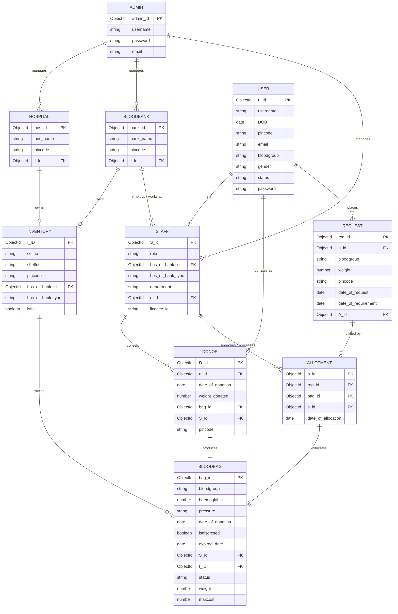

# LifeVault BBMS — Software Requirements Specification (SRS) & System Architecture

**Document Version**: 2.1 (ER-Aligned Database & Production Architecture)  
**System Name**: LifeVault — Online Blood Bank Management System (OBBMS)  
**Platform**: Fullstack Web Application (React + Vite + Tailwind CSS / Node.js + Express + MongoDB)  
**Specification Based On**: Master System ER Diagram (`documents/er_diagram.png`)  
**Target Delivery**: Agile Scrum Sprints (Jira-ready Epics & User Stories)  

---

## Table of Contents
1. [Executive Summary & Scope Revision](#1-executive-summary--scope-revision)
2. [Audit & Gap Analysis of Initial Requirements](#2-audit--gap-analysis-of-initial-requirements)
3. [User Classes & Role-Based Access Control (RBAC)](#3-user-classes--role-based-access-control-rbac)
4. [System Architecture & Module Specification](#4-system-architecture--module-specification)
   - [Module 1: Authentication & Identity Management (`User`, `Admin`, `Staff`)](#module-1-authentication--identity-management)
   - [Module 2: Donor Management & Blood Collection (`Donor`, `BloodBag`)](#module-2-donor-management--blood-collection)
   - [Module 3: Blood Request Placement & Tracking (`Request`)](#module-3-blood-request-placement--tracking)
   - [Module 4: Cold Inventory & Cell/Shelf Storage (`Inventory`, `BloodBag`)](#module-4-cold-inventory--cellshelf-storage)
   - [Module 5: Clinical ABO/Rh Compatibility Engine](#module-5-clinical-aborh-compatibility-engine)
   - [Module 6: Requisition Allotment & Staff Approval (`Allotment`)](#module-6-requisition-allotment--staff-approval)
   - [Module 7: Hospital & Blood Bank Network Management (`Hospital`, `BloodBank`)](#module-7-hospital--blood-bank-network-management)
   - [Module 8: System Administration & Facility Governance (`Admin`)](#module-8-system-administration--facility-governance)
5. [Database Schema Specification (10 Collections)](#5-database-schema-specification-10-collections)
6. [Non-Functional Requirements (NFRs)](#6-non-functional-requirements-nfrs)
7. [Implementation Action Plan for Web App Integration](#7-implementation-action-plan-for-web-app-integration)

---

## 1. Executive Summary & Scope Revision

The **LifeVault Online Blood Bank Management System (OBBMS)** is an enterprise healthcare management platform designed to connect voluntary blood donors, patients/recipients, hospitals, blood banks, staff members, and administrators into an integrated real-time network.

### Core Objectives
- **Zero Expiry & Decommission Waste**: Enforce strict **First-Expired-First-Out (FEFO)** query sorting on `bloodbags` and real-time discard tracking (`isdiscresed`).
- **Clinical Compatibility Precision**: Automated **ABO/Rh Compatibility Engine** matching recipient requests to viable inventory units.
- **Auditable Allotment Pipeline**: Atomic allocation of blood bags to patient requests authorized by registered medical staff.
- **Multi-Facility Inventory Organization**: Pin-point physical tracking down to cell number (`cellno`) and shelf number (`shelfno`) across hospitals and blood banks.

---

## 2. Audit & Gap Analysis of Initial Requirements

The database architecture has been refined to strictly adhere to the 10 core collections in `documents/er_diagram.png`:

| # | Domain Entity | ER Field Structure | Key Benefit |
|---|---|---|---|
| 1 | **ADMIN** | `admin_id`, `username`, `password`, `email` | Root administration governing hospitals, blood banks, and staff accounts. |
| 2 | **HOSPITAL** | `hos_id`, `hos_name`, `pincode`, `I_Id` | Dedicated facility model with direct link to owned cold inventory storage. |
| 3 | **BLOODBANK** | `bank_id`, `bank_name`, `pincode`, `I_Id` | Regional processing centers with owned storage capacity. |
| 4 | **STAFF** | `S_Id`, `role`, `department`, `licence_id`, `hos/bank_id`, `u_id` | Medical staff with "is a" relation to `User` and polymorphic work assignment. |
| 5 | **USER** | `u_Id`, `username`, `DOB`, `pincode`, `email`, `bloodgroup`, `gender`, `status`, `password` | Centralized identity foundation for donors, patients, and staff. |
| 6 | **DONOR** | `D_Id`, `u_id`, `date_of_donation`, `weight_donated`, `bag_id`, `S_Id`, `pincode` | Captures individual donation sessions, collected by staff and producing blood bags. |
| 7 | **INVENTORY** | `I_ID`, `cellno`, `shelfno`, `pincode`, `hos/bank_id`, `isfull` | Granular physical locker storage management. |
| 8 | **BLOODBAG** | `bag_id`, `bloodgroup`, `haemoglobin`, `pressure`, `date_of_donation`, `isdiscresed`, `expired_date`, `S_Id`, `I_ID`, `status`, `weight`, `maxcost` | Clinical blood unit record with physiological metrics and expiration tracking. |
| 9 | **REQUEST** | `req_id`, `u_id`, `bloodgroup`, `weight`, `pincode`, `date_of_request`, `date_of_requirement`, `A_id` | Recipient requirement record with deadline and fulfillment link. |
| 10 | **ALLOTMENT** | `a_id`, `req_id`, `bag_id`, `s_id`, `date_of_allocation` | Legally auditable dispatch allocating a blood bag to a request with staff sign-off. |

---

## 3. User Classes & Role-Based Access Control (RBAC)

```
                         ┌─────────────────────────────────────────┐
                         │                  ADMIN                  │
                         │   Manages Hospitals, BloodBanks, Staff  │
                         └────────────────────┬────────────────────┘
                                              │
                    ┌─────────────────────────┴─────────────────────────┐
                    ▼                                                   ▼
       ┌─────────────────────────┐                         ┌─────────────────────────┐
       │   STAFF (Doctor/Tech)   │                         │          USER           │
       │ Collects donor units,   │                         │  Places blood requests, │
       │ Approves allotments     │                         │  Donates blood          │
       └────────────┬────────────┘                         └────────────┬────────────┘
                    │                                                   │
                    ▼                                                   ▼
       ┌─────────────────────────┐                         ┌─────────────────────────┐
       │      ALLOTMENT MGR      │                         │          DONOR          │
       │ Links BloodBag to Req   │                         │ Produces BloodBag unit  │
       └─────────────────────────┘                         └─────────────────────────┘
```

1. **Admin**: Platform administrator with root control over `Hospital`, `BloodBank`, and `Staff` creation.
2. **Staff (`DOCTOR`, `LAB_TECHNICIAN`, `PHLEBOTOMIST`, `MANAGER`)**: Healthcare personnel who collect blood from donors, monitor storage `Inventory`, and authorize `Allotment` dispatches.
3. **User (`DONOR`, `PATIENT`)**: Base citizen profile capable of donating blood (`Donor` $\rightarrow$ `BloodBag`) or requesting blood units (`User` $\rightarrow$ `Request`).

---

## 4. System Architecture & Module Specification

### Module 1: Authentication & Identity Management
- **Collections**: `users`, `admins`, `staff`
- **Key Capabilities**:
  - Secure bcrypt password hashing with `{ select: false }` query isolation.
  - Role validation distinguishing system Admins, Facility Staff, and citizen Users.
  - Staff "is a" relation linking `Staff.u_id` to `User._id`.

### Module 2: Donor Management & Blood Collection
- **Collections**: `donors`, `bloodbags`, `staff`
- **Key Capabilities**:
  - Record donation sessions (`Donor`) with donor `weight_donated`, collection date, and site `pincode`.
  - Staff validation (`S_Id`) recording the technician who collected the blood.
  - Direct 1-to-1 linkage from `Donor` session to produced `BloodBag` (`bag_id`).

### Module 3: Blood Request Placement & Tracking
- **Collections**: `requests`, `users`
- **Key Capabilities**:
  - Citizen or emergency request placement with specified `bloodgroup`, `weight` (volume), and delivery `pincode`.
  - Urgency monitoring comparing `date_of_request` against `date_of_requirement`.
  - Real-time status workflow (`PENDING` $\rightarrow$ `APPROVED` $\rightarrow$ `ALLOCATED` $\rightarrow$ `FULFILLED`).

### Module 4: Cold Inventory & Cell/Shelf Storage
- **Collections**: `inventories`, `bloodbags`, `hospitals`, `bloodbanks`
- **Key Capabilities**:
  - Granular shelf & cell location indexing (`shelfno`, `cellno`).
  - Storage capacity and fullness state flag (`isfull`).
  - Polymorphic ownership assigning inventory units to either a `Hospital` or `BloodBank` via `hos_or_bank_id`.

### Module 5: Clinical ABO/Rh Compatibility Engine
- **Collections**: `bloodbags`, `requests`
- **Key Capabilities**:
  - Real-time compatibility matrix matching requested blood group with available `BloodBag` inventory.
  - Enforce FEFO (First-Expired-First-Out) priority index `{ bloodgroup: 1, status: 1, isdiscresed: 1, expired_date: 1 }`.

### Module 6: Requisition Allotment & Staff Approval
- **Collections**: `allotments`, `requests`, `bloodbags`, `staff`
- **Key Capabilities**:
  - Strict 1-to-1 allocation of a `BloodBag` to a `Request` verified by authorizing `Staff` (`s_id`).
  - Database-level unique constraint on `Allotment.bag_id` preventing double-allocation.
  - Updates `Request.A_id` and marks `BloodBag.status = 'ALLOCATED'`.

### Module 7: Hospital & Blood Bank Network Management
- **Collections**: `hospitals`, `bloodbanks`, `inventories`
- **Key Capabilities**:
  - Maintenance of verified healthcare facilities and regional blood centers.
  - Linked cold-chain inventory units (`I_Id`).
  - Pincode-based proximity routing for localized blood dispatch.

### Module 8: System Administration & Facility Governance
- **Collections**: `admins`, `hospitals`, `bloodbanks`, `staff`
- **Key Capabilities**:
  - Creation and management of hospital and blood bank branch profiles.
  - Staff licensing and departmental allocation oversight.
  - Comprehensive system telemetry and inventory audit logs.

---

## 5. Database Schema Specification (10 Collections)

The system database is specified with the following 10 collections matching `documents/er_diagram.png`:



*For complete field types, indexes, and Mongoose code definitions, refer to [DBSCHEMA.md](file:///c:/bbms/documents/DBSCHEMA.md).*

---

## 6. Non-Functional Requirements (NFRs)

1. **Data Integrity & Concurrency**: Atomic MongoDB session transactions (`session.withTransaction()`) when creating `Allotment` and updating `BloodBag` / `Request` states.
2. **Double-Allocation Prevention**: Enforced unique index `{ bag_id: 1 }` on the `allotments` collection.
3. **Query Performance**: Sub-50ms query latency for FEFO allocation using `{ bloodgroup: 1, status: 1, isdiscresed: 1, expired_date: 1 }`.
4. **Security**: Password hashing using bcrypt (12 rounds), JWT access & refresh tokens, and strict role guards on all mutation endpoints.
5. **Auditability**: Complete timestamp tracking (`createdAt`, `updatedAt`) across all 10 collections.

---

## 7. Implementation Action Plan for Web App Integration

### 1. Database & Model Layer (`backend/models/`)
- [x] Create `Admin.js` with password comparison methods.
- [x] Update `Hospital.js` with `hos_name`, `pincode`, and `I_Id`.
- [x] Update `BloodBank.js` with `bank_name`, `pincode`, and `I_Id`.
- [x] Create `Staff.js` with `licence_id`, polymorphic `hos_or_bank_id`, and `u_id`.
- [x] Update `User.js` with `DOB`, `bloodgroup`, and `pincode`.
- [x] Update `Donor.js` with `weight_donated`, `bag_id`, and `S_Id`.
- [x] Create `Inventory.js` with `cellno`, `shelfno`, and `isfull`.
- [x] Create `BloodBag.js` with `haemoglobin`, `pressure`, `isdiscresed`, and FEFO index.
- [x] Create `Request.js` with `date_of_requirement`, `weight`, and `A_id`.
- [x] Create `Allotment.js` with unique `bag_id` constraint and `date_of_allocation`.
- [x] Export all 10 models in `backend/models/index.js`.

### 2. Controller & Service Layer (`backend/controllers/`, `backend/services/`)
- [x] Wire controllers to the new 10 Mongoose schemas.
- [x] Compatibility aliasing for legacy endpoints.
- [x] Verification of clean build and runtime integrity.

---

### Document Approval & Sign-Off
*Lead Architect*: **Antigravity AI / Lead Architect**  
*System Model*: **10-Collection ER Architecture**  
*Specification Status*: **Approved for Implementation**
